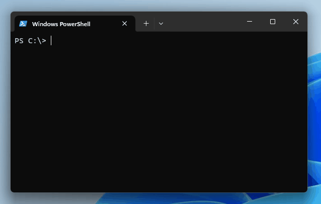

# IP Tool

## Overview

IP Tool is a command-line utility designed to simplify common tasks related to computer networking. It's written in Go and is available as a single executable file that can be downloaded and used on most operating systems, including Windows, macOS, and Linux.



IP Tool offers the following functionality:

- **Inspection**: IP Tool enables you to inspect IP addresses, providing you with information such as the network address, broadcast address, and the number of hosts in the subnet.
- **Subnetting**: It also allows you to perform subnetting operations, and can be a handy tool for network engineers and administrators.
- **TCP**: IP Tool provides a set of TCP tools for IP networks, including a TCP ping command that can be used to check if a TCP port is open on a host, measure the latency of a TCP connection over time, and export the results to a CSV file for further analysis.

## Usage

```bash
iptool [command]
```

## Available Commands

- `inspect`: Take a closer look at an IP address
- `subnet`: Subnetting tools for IP networks
- `tcp`: TCP tools for IP networks

## Help
Every command and subcommand in IP Tool has its own help page.

Use the `--help` (or `-h`) flag to get more information about a command or subcommand. For example:

```bash
iptool inspect --help
```

## Installation

Here's a short instruction on how to get started using the IP Tool application by downloading the executable from its GitHub releases page and placing the file in your PATH:

1. **Download the Executable**:

   Visit the IP Tool releases page on GitHub by following this link: [https://github.com/bitcanon/iptool/releases](https://github.com/bitcanon/iptool/releases).

2. **Choose Your Operating System**:

   On the releases page, you will find a list of available releases for various operating systems. Choose the appropriate release for your system. IP Tool supports most operating systems, so select the one that matches your setup, such as Windows, macOS, or Linux.

3. **Download and Extract the Executable**:

   When you click on the release version to download, you will typically receive a compressed archive file (e.g., a `.zip` or `.tgz` file) that contains the IP Tool executable. Download this compressed archive and extract the executable from it using your preferred archive utility.

4. **Place the Executable in Your PATH**:

   Once the executable is downloaded and extracted, move it to a directory that is included in your systems PATH. This ensures that you can run the `iptool` command from any location in your terminal.

5. **Verify Installation**:

   To verify that the installation was successful, open a terminal window and type:

   ```bash
   iptool --version
   ```
   If you see the version number of IP Tool displayed in the terminal, it means the tool is installed and ready to use.

With these steps, you should now have the IP Tool executable properly downloaded, extracted, and accessible from your terminal. Enjoy using IP Tool for your networking tasks!

## Getting Started

Let's explore some of the common use cases for IP Tool.

### Inspect Command

To inspect the details if an IP address, use the `inspect` command. For example:

```bash
iptool inspect 10.0.0.1 255.255.255.0
```


For more details on the `inspect` command, please refer to the [Inspect Command](https://github.com/bitcanon/iptool/wiki/iptool-inspect) documentation.

### Subnet Commands

IP Tool also provides a set of commands for subnetting operations. To see the list of available commands, type:

```bash
iptool subnet
```

#### Subnet List

You can display a simple subnetting cheat sheet using the `subnet list` command:

```bash
iptool subnet list
```


>The alias `iptool subnet ls` can also be used.

For more details on the `iptool subnet list` command, please refer to the [Subnet List Command](https://github.com/bitcanon/iptool/wiki/iptool-subnet-list) documentation.

### TCP Commands

At the moment, IP Tool provides a single command for TCP operations.

#### TCP Ping

You can use the `iptool tcp ping` command to: 
* Check if a TCP port is open on a host
* Measure the latency of a TCP connection over time
* Export the results to a CSV file for further analysis
* Connect to any TCP port (1-65535)
* Modify the behavior of the command using flags

```bash
iptool tcp ping www.github.com -c 5
```


#### CSV Export

Use the CSV export functionality to simplify further analysis in another tool:

```bash
iptool tcp ping www.github.com --csv -o github.csv
```


For more details on the `iptool tcp ping` command, please refer to the [TCP Ping Command](https://github.com/bitcanon/iptool/wiki/iptool-tcp-ping) documentation.

## Configuration

You can customize IP Tool's behavior by using a configuration file. By default, the tool looks for a configuration file at `$HOME/.iptool.yaml`.

## License

IP Tool is open-source software licensed under the [MIT License](LICENSE).
